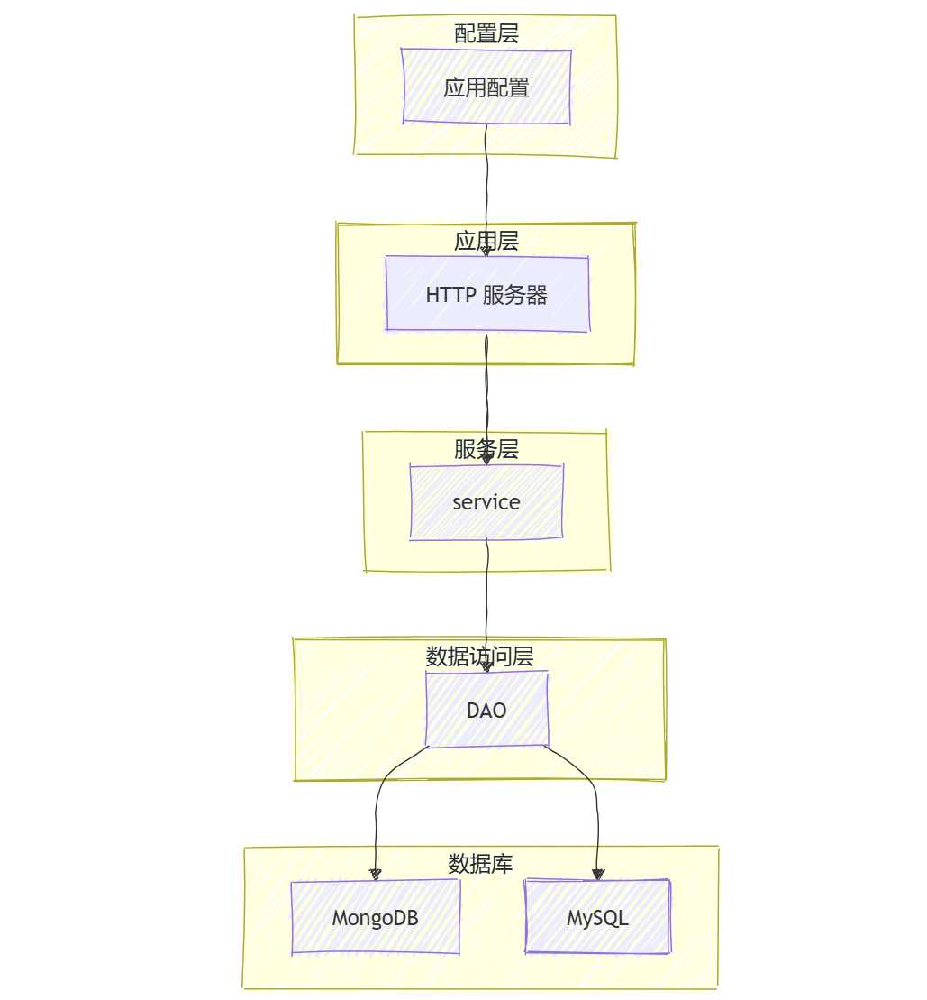
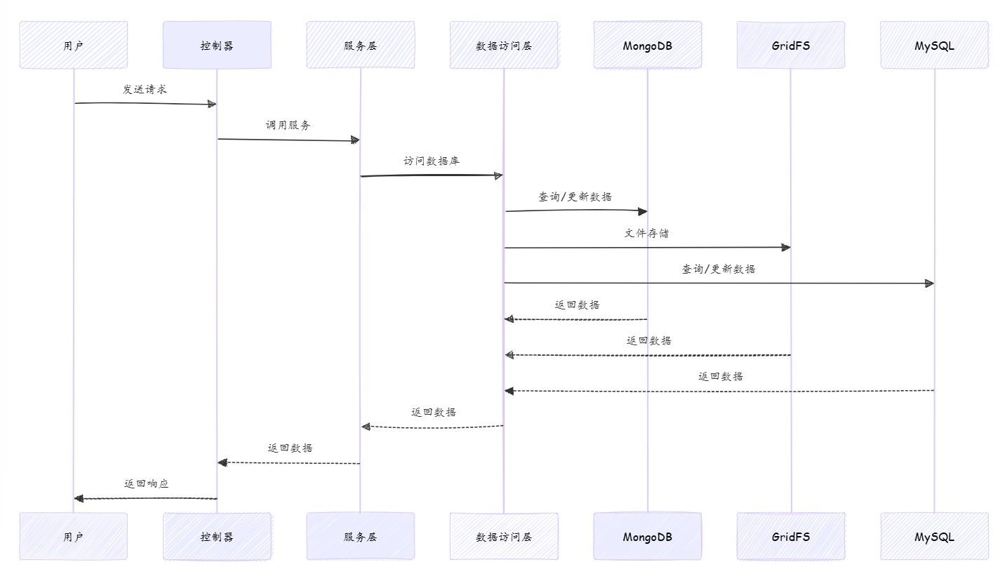

# **一、总体功能**

本项目是xjtuana（西安交通大学网管协会）的社团招新系统，用Go语言编写，主要包括用户注册、登录、信息收集、面试安排、表单提交和管理等功能。

# **二、项目架构**

## 项目架构图



*file.go等文件中用到了GridFS，但这个我查的是MongoDB的文件储存系统，所以这里没有画出来*

## 1.配置管理包（package config)

负责加载和管理应用程序的配置参数

核心代码(config.go)
```Go
type Config struct {
	APIURL         string        `json:"api_url"`
	DatabaseCI     string        `json:"databaseConnectionInfo"`
	XjtunicDB      string        `json:"xjtunic_db"`
	JwtKey         string        `json:"jwtKey"`
	HttpAddr       string        `json:"http_addr"`
	TokenSpan      time.Duration `json:"token_span"`
	BotToken       string        `json:"botToken"`
	SmsUser        string        `json:"sms_user"`
	SmsKey         string        `json:"sms_key"`
	SMTPHost       string        `json:"smtp_host"`
	SMTPPort       int           `json:"smtp_port"`
	SMTPUser       string        `json:"smtp_user"`
	SMTPPassword   string        `json:"smtp_password"`
	SMTPNickname   string        `json:"smtp_nickname"`
	OAuth2ID       string        `json:"oauth2_id"`
	OAuth2Secret   string        `json:"oauth2_secret"`
	OAuth2Redirect string        `json:"oauth2_redirect"`
	OAuth2Scopes   []string      `json:"oauth2_scopes"`
	OAuth2AuthURL  string        `json:"oauth2_auth_url"`
	OAuth2TokenURL string        `json:"oauth2_token_url"`
}
```
config.go中的Config结构体中包含了基础服务配置（APIURL,HttpAddr)、数据库配置（DatabaseCI,XjtunicDB),认证安全（JwtKey,TokenSpan,Oauth...)和第三方服务集成（SmsUser...)

## 2.HTTP服务器（package http）

负责处理HTTP请求和相应，定义了各种API路由和处理函数

核心代码(http.go)
```Go
func (s *Server) setRoutes() {
	router := router.New()
	router.GET("/api/ping", Pong)
	router.GET("/api/login", s.Login)
	router.GET("/api/callback", s.LoginCallBack)
	router.GET("/api/user", s.UserInfo)
	router.PATCH("/api/user", s.UpdateUserInfo)
	router.GET("/api/round", s.GetGetAllRound)
	router.GET("/api/case", s.GetAllCase)
	router.GET("/api/case/export", s.ExportAllCase)
	router.POST("/api/case", s.CreateCase)
	router.GET("/api/case/{caseID}/log", s.GetApplicationCaseLogs)
	router.GET("/api/case/{caseID}/forms", s.GetFormsOfCase)
	router.GET("/api/case/{caseID}/forms/{formID}.pdf", s.GetFormPDF)
	router.GET("/api/case/{caseID}/forms/{formID}/file/{questionID}.pdf", s.GetFile)
	router.GET("/api/status/{id}", s.GetGetStatus)
	router.GET("/api/form/{id}", s.GetGetForm)
	router.POST("/api/form/{id}", s.SubmitForm)
	router.GET("/api/sform/{id}/", s.GetAllSubmittedForms)
	router.GET("/api/sform/{id}/export", s.ExportAllSubmittedForms)
	router.POST("/api/admin/{id}", s.PostAdminAction)
	router.GET("/api/interview_raw", s.GetRawInterview)
	router.GET("/api/interview", s.GetInterview)
	router.POST("/api/interview", s.PostInterview)
	router.POST("/api/interview/{id}/schedule", s.PostInterviewSchedule)
	router.GET("/api/interview/{id}/schedule", s.GetInterviewSchedule)
	router.POST("/api/interview/{id}/confirm", s.ConfirmInterview)
	router.GET("/api/interview/{id}/available_cases", s.GetAvailableCasesByInterview)
	router.GET("/api/interview/{id}/pdf", s.PrintInterviewList)
	//router.POST("/api/file/{formid}/{caseid}/{qid}", UploadFile)
	router.GET("/api/user/id/{id}", s.GetUserByID)
	router.GET("/api/case/status/{status}", s.GetCaseByStatus)
	//router.GET("/api/caseowner/qq/status/{status}", s.GetCaseOwnerQQByStatus)
	s.router = router
}
```
该段代码利用多个定义函数处理用户的各种请求，包括登录、更新用户信息、导出案例、导出pdf等，这些函数在package http中的文件中均有定义

## 3.服务层(package service)

负责业务逻辑的实现，包括用户验证、面试安排、表单的验证和上传等
包含admin（处理管理员操作）、case（创建案例、获取案例信息等）、file（上传和下载文件）、form（提交表单、获取表单数据等）、interview（安排面试、获取面试信息等）、log、mail等等子模块，分别对不同业务逻辑进行处理

下面以service.go为例：
```Go
func New(cfg *config.Config) *Service {
    svc := &Service{cfg: cfg, dao: dao.New(cfg)}
    svc.init()
    return svc
}

func (s *Service) init() {
    s.mutex.Lock()
    s.oauthCfg = &oauth2.Config{
        RedirectURL:  s.cfg.OAuth2Redirect,
        ClientID:     s.cfg.OAuth2ID,
        ClientSecret: s.cfg.OAuth2Secret,
        Scopes:       s.cfg.OAuth2Scopes,
        Endpoint: oauth2.Endpoint{
            AuthURL:  s.cfg.OAuth2AuthURL,
            TokenURL: s.cfg.OAuth2TokenURL,
        },
    }
    s.mutex.Unlock()
}

func (s *Service) Close() error {
    s.mutex.Lock()
    if s.closing {
        s.mutex.Unlock()
        return ErrShutdown
    }
    s.closing = true
    s.mutex.Unlock()
    return s.dao.Close()
}
```
New函数接受配置信息初始化service，init方法中从配置中读取了OAuth相关参数，构建oauth2.Config对象，处理OAuth2的认证流程，最后是Close方法，用于关闭服务。总的来说，service模块用于初始化和关闭服务。

## 4.数据访问层（package dao）
dao（Data Access Object)为数据库提供接口
负责与数据库（MongoDB,MySQL）交互，执行数据的增删查改等操作
以log.go为例：
```Go
func (d *DAO) FindLogs(data *bson.M) (*[]model.TransferLog, error) {
    ctx := context.Background()
    results := []model.TransferLog{}
    cur, err := d.transferLog.Find(ctx, data)
    if err != nil {
        return nil, err
    }
    defer cur.Close(ctx)
    for cur.Next(ctx) {
        var elem model.TransferLog
        err := cur.Decode(&elem)
        if err != nil {
            return nil, err
        }
        results = append(results, elem)
    }
    return &results, nil
}

func (d *DAO) InsertTransferLog(item *model.TransferLog) {
    d.transferLog.InsertOne(context.Background(), item)
}
```
- ==FindLogs==函数根据数据查找日志
- ==InsertTransferLog==函数插入新的日志数据

## 5.其他包
### package dto

dto包（Data Transfer Object)，用于定义数据传输对象，这些对象在不同层之间传递数据
### package aes

主要用于实现AES加密和解密功能。AES(Advanced Encryption Standard),是一种流行的区块加密标准。

### package model

用于定义数据库模型和业务实体，这些模型通常与数据库的表结构对应。例如包中的==ApplicationCase==定义了申请案例的数据库模型。


# 三、主要功能

1. **用户管理**：
   - 用户可以注册、登录和更新个人信息。
   - 用户信息包括姓名、邮箱、电话、QQ 号、校区、班级、学院、职位、UserID、ANAID、Netid等。

2. **面试安排**：
   - 管理员可以创建和安排面试，用户可以查看和确认面试时间。
   - 面试安排包括面试的开始时间、持续时间、面试官和面试地点等。

3. **表单管理**：
   - 用户可以填写和提交申请表单，表单内容包括各种问题和答案。
   - 表单提交后，系统会进行验证，并根据预定义的规则进行状态转移。

4. **状态转移**：
   - 系统根据预定义的规则自动或手动进行状态转移，如面试通过、面试失败等。
   - 状态转移规则存储在数据库中，并由服务层进行解析和执行。

5. **日志记录**：
   - 系统记录用户的操作日志和状态转移日志，便于管理员查看和追踪。

## 业务流程图

